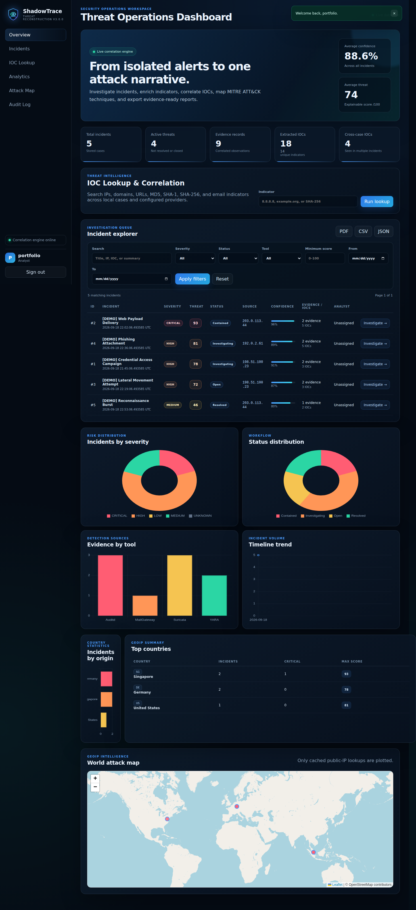
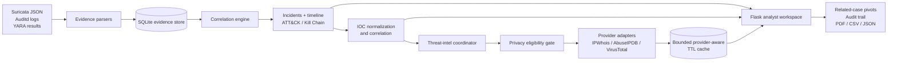

<p align="center">
  
</p>

# ShadowTrace

**A DFIR and threat-intelligence investigation platform for reconstructing incidents from network, host, and file evidence.**

[](https://github.com/sarahalqaisi/ShadowTrace-v3/actions/workflows/ci.yml)
[](https://www.python.org/)
[](https://flask.palletsprojects.com/)
[](LICENSE)

ShadowTrace helps an analyst move from heterogeneous evidence to an explainable case: normalize and correlate IOCs, reconstruct a timeline, enrich eligible public indicators, pivot to related incidents, and export an investigation report. It is intentionally distinct from a detection-rule platform: ShadowTrace focuses on the investigation that follows collected security evidence.

> Portfolio/reference implementation. It does not monitor deployed infrastructure, provide measured detection accuracy, or replace a production SIEM/SOAR, forensic suite, or threat-intelligence platform.

## What it demonstrates

- Deterministic IOC normalization and cross-incident correlation for IPs, domains, URLs, hashes, and email addresses
- Evidence-backed incident timelines with ATT&CK and Cyber Kill Chain context
- Optional live VirusTotal, AbuseIPDB, and IPWhois enrichment through isolated provider adapters
- Explicit, deterministic offline mode with no silent fallback from live provider failures
- Analyst workflow, audit trail, similarity pivots, and PDF/CSV/JSON reporting



## Architecture



The web request path remains synchronous and bounded by per-provider timeouts. A background job queue was deliberately not added: Flask plus local SQLite has no durable worker or distributed locking model, and an in-process thread pool could lose work during restart. The provider protocol and coordinator provide the seam for a future durable queue.

## Demo flow

1. Initialize the database and create an analyst account.
2. Load the deterministic synthetic seed dataset.
3. Open the incident queue and filter by score, severity, status, tool, or IOC.
4. Inspect evidence, the reconstructed timeline, ATT&CK context, and correlated indicators.
5. Pivot to Similar Incidents, add an investigation note, and export a report.

The seed data is synthetic and uses documentation-safe address ranges. Offline mode makes no external provider requests. It is not a claim of real-world detection performance or forensic validation.

## Quick start

Requires Python 3.11 or newer.

```bash
python3 -m venv .venv
source .venv/bin/activate
python -m pip install -r requirements.txt
cp .env.example .env
python -c "import secrets; print(secrets.token_urlsafe(48))"
# Put the generated value in SHADOWTRACE_SECRET_KEY within .env
python scripts/init_db.py
python scripts/create_user.py --role Admin
python scripts/seed_data.py
python run.py
```

Open `http://127.0.0.1:5000`. The convenience `setup_kali.sh --create-user` performs the same local setup on Kali Linux.

## Threat-intelligence modes

The default is explicit offline mode:

```env
SHADOWTRACE_THREAT_INTEL_MODE=offline
```

Offline mode returns structured disabled-provider results; it does not invent provider verdicts. To make real provider requests, deliberately select live mode and configure the intended keys:

```env
SHADOWTRACE_THREAT_INTEL_MODE=live
ABUSEIPDB_API_KEY=...
VIRUSTOTAL_API_KEY=...
```

IPWhois does not require a key. Live requests use fixed HTTPS destinations, TLS verification, disabled redirects, explicit timeouts, response-size limits, sanitized error categories, and a bounded provider-aware TTL cache. Private, loopback, link-local, reserved, multicast, unspecified, documentation-range, localhost, and internal/reserved-domain indicators are not submitted. Review provider privacy, retention, quotas, and regional requirements first.

## Evidence ingestion and correlation

```bash
python parsers/suricata_parser.py /path/to/eve.json
python parsers/auditd_parser.py /path/to/audit.log
python parsers/yara_parser.py detection-rules/yara/shadowtrace_suspicious.yar /path/to/file
python correlation-engine/correlate.py
```

Parsers preserve the source event text and add a deterministic SHA-256 fingerprint over canonical evidence fields. This provides tamper-evident integrity support for later comparisons; it is not a signed attestation or legal chain of custody. Treat the database, imports, provider results, and exported reports as sensitive. ShadowTrace does not acquire forensic disk images or independently prove chain of custody.

## API and reports

Authenticated routes retain the v3 response contracts:

- `GET /api/dashboard`
- `GET /api/incidents`
- `GET /api/ioc/lookup?value=<indicator>`
- `GET /api/incidents/<id>/similar`
- `GET /api/map` and `GET /api/countries`

Provider-normalized metadata is additive under `intelligence.provider_results`; established `geo`, `abuseipdb`, `virustotal`, and `risk` fields remain available. Incident and filtered-queue reports support PDF, CSV, and JSON.

## Testing and validation

```bash
python -m pip install -r requirements-dev.txt
python -m pytest -q
python -m compileall -q dashboard parsers scripts correlation-engine tests
python -m pip_audit --requirement requirements.txt
git diff --check
```

CI uses offline mode and no live provider keys. See the [threat-intelligence architecture](docs/THREAT_INTELLIGENCE.md) and [validation notes](docs/VALIDATION.md).

## Container

```bash
docker build -t shadowtrace:local .
docker run --rm -p 8000:8000 \
  -e SHADOWTRACE_SECRET_KEY="$(python -c 'import secrets; print(secrets.token_urlsafe(48))')" \
  -v shadowtrace-data:/data shadowtrace:local
```

The image runs Gunicorn as an unprivileged user, stores mutable data under `/data`, includes a health check, and excludes local secrets/databases from the build context. Terminate TLS at a reviewed reverse proxy.

## Security and production limitations

The application includes CSRF protection, secure cookie options, parameterized SQL, security headers, sanitized server-error responses, authenticated APIs, and an audit trail. Before any internet-facing deployment, add centralized authentication, granular RBAC, rate limiting, session revocation, monitoring, encrypted backups, a managed secret store, formal evidence-retention controls, and an operational database appropriate for concurrent replicas.

See [SECURITY.md](SECURITY.md), [CONTRIBUTING.md](CONTRIBUTING.md), and [CHANGELOG.md](CHANGELOG.md).

## Repository map

```text
dashboard/              Flask UI/API, database layer, services, templates, assets
correlation-engine/     Deterministic incident correlation pipeline
parsers/                Suricata, Auditd, and YARA evidence importers
detection-rules/        Demonstration Suricata and YARA rules
database/               Additive SQLite schema and migration reference
sample-evidence/        Safe synthetic demonstration evidence
scripts/                Setup, account, database, and seed helpers
tests/                  Application, IOC, provider, workflow, report, migration tests
```

Licensed under the [Apache License 2.0](LICENSE).
